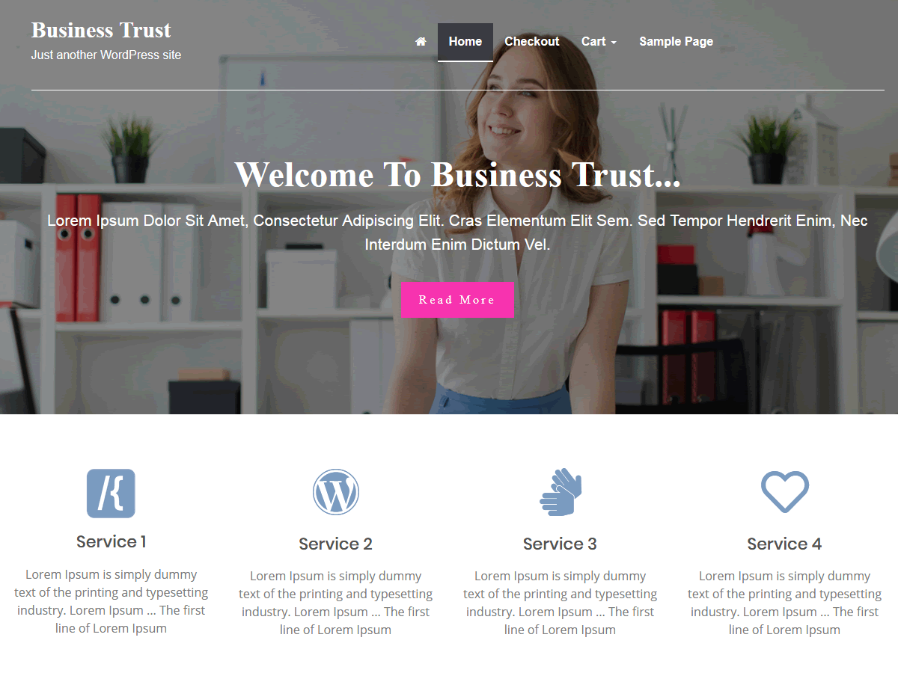

# Business Trust WordPress theme

Business Trust is a fully customizable free WordPress theme with many amazing features. You can use this theme for blog, portfolio, business web site, online store, storefront and eCommerce websites. With WooCommerce, creating a business website is a pretty easy task. It also has a featured slider where you can showcase your business details and contents. The theme uses bootstrap and he responsive design of the theme will render on all viewing devices. Business Trust also has many sections to highlight different aspects of your business.

== Description ==

Hi. I'm a starter theme called 'Business Trust' build from underscores, if you like. I'm a theme meant for hacking so don't use me as a Parent Theme. Instead try turning me into the next, most awesome, WordPress theme out there. That's what I'm here for.

== Installation ==

1. In your admin panel, go to Appearance > Themes and click the Add New button.
2. Click Upload and Choose File, then select the theme's .zip file. Click Install Now.
3. Click Activate to use your new theme right away.

== Frequently Asked Questions ==

= Does this theme support any plugins? =

business-trust includes support for Infinite Scroll in Jetpack.

== Changelog ==

= 1.0 - May 12 2015 =
* Initial release

== Resources ==

* Based on Underscores http://underscores.me/, (C) 2012-2016 Automattic, Inc., [GPLv2 or later](https://www.gnu.org/licenses/gpl-2.0.html)

* Normalize.css http://necolas.github.io/normalize.css/, (C) 2012-2016 Nicolas Gallagher and Jonathan Neal, [MIT](http://opensource.org/licenses/MIT)

* Font Awesome SVG icons http://fontawesome.io/, (C) Dave Gandy, [CC BY 4.0](https://fontawesome.com/license/free)

* Bootstrap v4+, Copyright 2011-2015 Twitter, Inc. Licenses: MIT Source: http://getbootstrap.com

* GitHub Plugin URI: https://github.com/wp-bootstrap/wp-bootstrap-navwalker License: GPL-3.0+ License URI: http://www.gnu.org/licenses/gpl-3.0.txt

== Images ==

*  https://pxhere.com/en/photo/1456583 | License CC0

== Changelog ==
= 1.0.0 - October 5 2019 =
* Initial release
